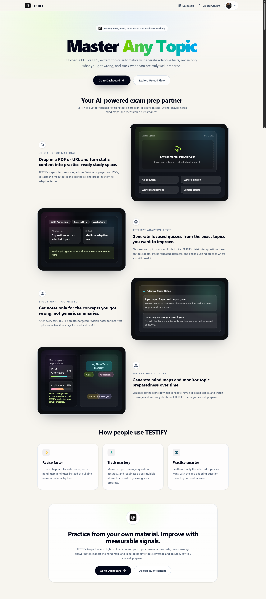
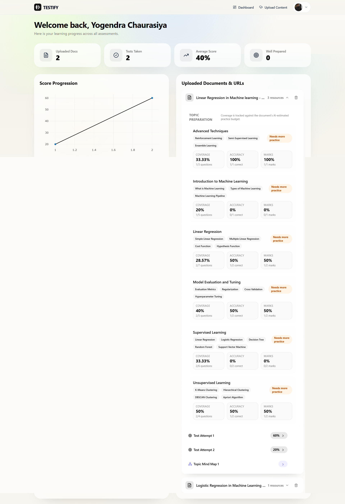
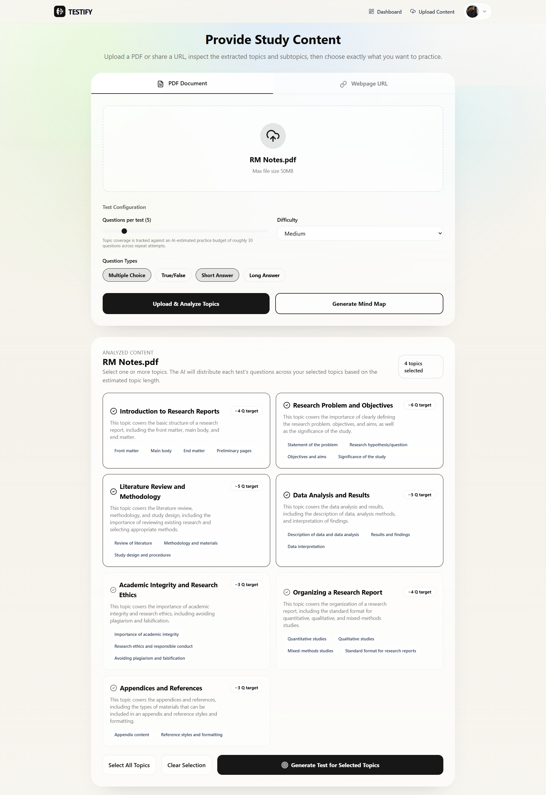
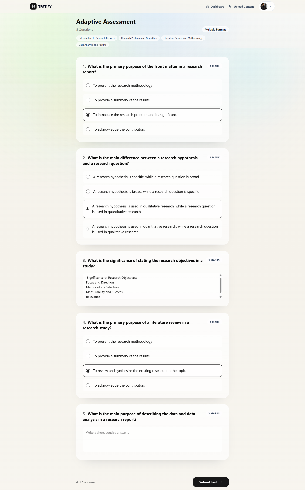
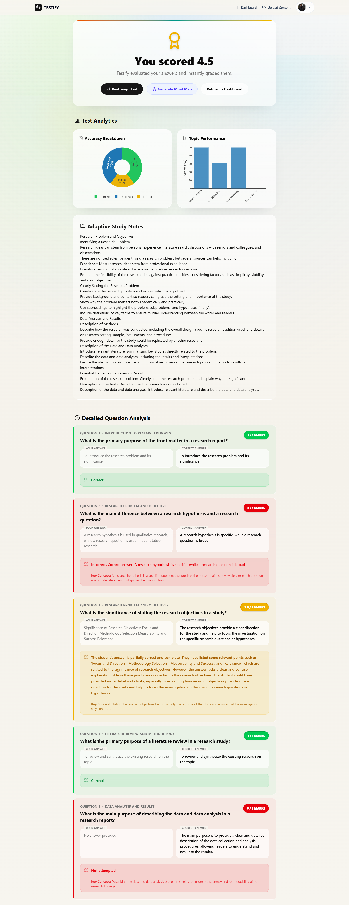
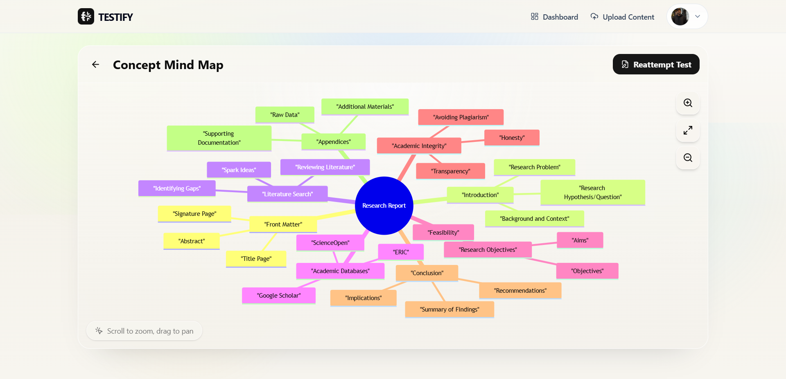

<div align="center">
  
  # 🎓 TESTIFY - The Ultimate AI Learning Platform

  <br />
  <br />

  [](https://testifyproject.vercel.app)
  []()
  []()
  []()
  
  <p align="center">
    <b>Transform your static study materials into interactive, AI-driven assessments and mind maps.</b>
  </p>
</div>

---

## 🌟 Overview

**TESTIFY** is a full-stack, AI-powered educational platform designed to supercharge your learning process. By uploading PDFs or providing webpage URLs, TESTIFY uses advanced **Retrieval-Augmented Generation (RAG)** and **Large Language Models (LLMs)** to ingest your study material, extract core topics, and generate personalized mock tests and visual mind maps.

It actively tracks your progress, identifies your weak points, and adapts to ensure you master the material.

🔗 **Live Website:** [https://testifyproject.vercel.app](https://testifyproject.vercel.app)

---

## 📸 Platform Sneak Peek

<table align="center">
  <tr>
    <td></td>
    <td></td>
  </tr>
  <tr>
    <td></td>
    <td></td>
  </tr>
  <tr>
    <td></td>
    <td></td>
  </tr>
</table>

---

## ✨ Features & Benefits

### 🔥 For the Learner
* **Automated Topic Extraction:** No more reading endless pages. The AI scans your document and breaks it down into bite-sized, digestible topics and subtopics.
* **Custom Practice Tests:** Generate assessments tailored exactly to what you need. Choose the difficulty (Easy, Medium, Hard), number of questions, and format (MCQ, True/False, Short/Long Answer).
* **Interactive Mind Maps:** Visual learner? TESTIFY converts your uploaded text into interactive, visual node-diagrams to help you understand complex relationships effortlessly.
* **Smart Progress Tracking:** A comprehensive analytics dashboard tracks your scores, preparation levels, and topic-by-topic accuracy using dynamic charts.

### ⚙️ Under the Hood (How it Works)
1. **Content Ingestion:** PDFs are parsed via `PyPDF`, and URLs are scraped using `BeautifulSoup4`.
2. **Chunking & Embedding:** The text is split into semantic chunks and embedded into high-dimensional vectors using `HuggingFace sentence-transformers`.
3. **Vector Storage:** Embeddings are securely stored in a **Qdrant** Vector Database for lightning-fast semantic retrieval.
4. **RAG Pipeline:** When you request a test or mind map, the backend queries Qdrant for the most relevant context and feeds it to the **Groq LLM** via **LangChain**.
5. **Generative Output:** The LLM meticulously crafts questions, evaluates answers, or generates Mermaid.js mind map syntax—all grounded purely in your uploaded material (zero hallucinations).

---

## 🛠️ Tech Stack Architecture

TESTIFY is built with modern, scalable, and high-performance technologies, decoupled into a distinct Frontend and Backend.

### 💻 Frontend (Client-Side)
* **Framework:** React + Vite + TypeScript
* **Styling & UI:** Tailwind CSS (Premium glassmorphism, responsive design, fluid animations)
* **State Management & Data Fetching:** TanStack React Query
* **Authentication:** Firebase Auth (Google OAuth)
* **Data Visualization:** React-Plotly.js (Score progression) & Mermaid.js (Mind maps)
* **Hosting:** Vercel

### 🗄️ Backend (Server-Side)
* **Framework:** FastAPI (High-performance async Python framework)
* **AI & Orchestration:** LangChain
* **LLM Provider:** Groq (Ultra-low latency inference)
* **Embeddings:** HuggingFace `sentence-transformers`
* **Vector Database:** Qdrant
* **Primary Database:** Firebase Firestore (NoSQL database for user profiles, analytics, and document metadata)
* **Hosting:** Azure App Services

---

## 🚀 Getting Started (Local Development)

Want to run TESTIFY on your local machine? Follow these steps:

### Prerequisites
- Node.js (v18+)
- Python (3.9+)
- Firebase Project (with Auth & Firestore enabled)
- Groq API Key
- Qdrant Setup (Docker or Cloud)

### 1️⃣ Backend Setup
```bash
# Navigate to the backend directory
cd testify-backend

# Create and activate a virtual environment
python -m venv venv
source venv/bin/activate  # On Windows: .\venv\Scripts\activate

# Install dependencies
pip install -r requirements.txt

# Create your .env file and add your keys (Firebase credentials, Groq API, Qdrant URL, etc.)
# Start the FastAPI server
uvicorn main:app --reload --port 8000
```

### 2️⃣ Frontend Setup
```bash
# Navigate to the frontend directory
cd testify-frontend

# Install node modules
npm install

# Create your .env file with Vite & Firebase variables (VITE_API_BASE_URL=http://localhost:8000)
# Start the Vite development server
npm run dev
```

Visit `http://localhost:5173` to experience TESTIFY locally!

---
<div align="center">
  <i>Built with ❤️ for intelligent learning.</i>
</div>
